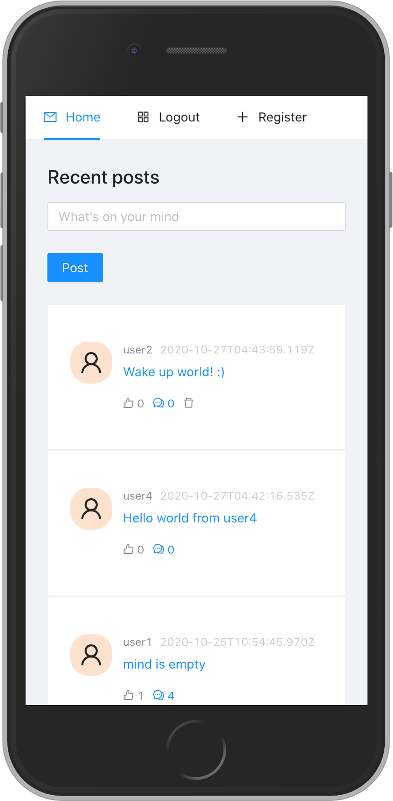

# Simple Tweet App

A simple tweet application to demonstrate and exercise #MERNG stack. Authorized users can tweet while others can react to tweets by commenting and liking.

## Build status

## Code style

This project follows `airbnb` Javascript coding styles. https://github.com/airbnb/javascript

## Screenshots

## Techstack

This app is on MERNG stack
- MongoDB
- Apollo Server (Express)
- React
- Node.js
- GraphQL
- Apollo Client
- Ant Design

This repository contains both server and client components of the application under `server` and `client` directories respectively.

## Installation

### Prerequisites
- [Node.js](https://nodejs.org/)
- [Git](https://git-scm.com/) [Optional]
- [MongoDB](https://www.mongodb.com/)

You can signup for MongoDB Atlas Cloud [free tier](https://www.mongodb.com/pricing)

### Steps
1. Clone/Download the project
2. Setup Server
    1. Install `npm` dependencies
        - `cd ./server`
        - `npm i`
    2. Configure server
        1. Rename `server/.env.sample` file to `server/.env`
        2. Update variables in the `server/.env`
    3. Start the server
        - `npm run serve`
        - For development purpose `npm run start` is available with `nodemon` server.
3. Setup Client
    1. Install `npm` dependencies
        - `cd ./client`
        - `npm i`
    2. Configure client
        1. Reanme `client/.env.sample` file to `client/.env`
        2. Update variables in `client/.env`
    3. Start the client
        - `npm run start`
        - This will start the development server on `http://localhost:3000`
        
## Credits
This project is a result of the MERNG tutorial "React / GraphQL Course - Build a social media app (MERNG Stack)" published on YouTub freeCodeCamp.org channel.  

YouTube: https://www.youtube.com/watch?v=n1mdAPFq2Os  
Github: https://github.com/hidjou/classsed-graphql-mern-apollo

## License
Simple Tweet App by Gihan S is licensed under CC0 1.0. To view a copy of this license, visit https://creativecommons.org/publicdomain/zero/1.0